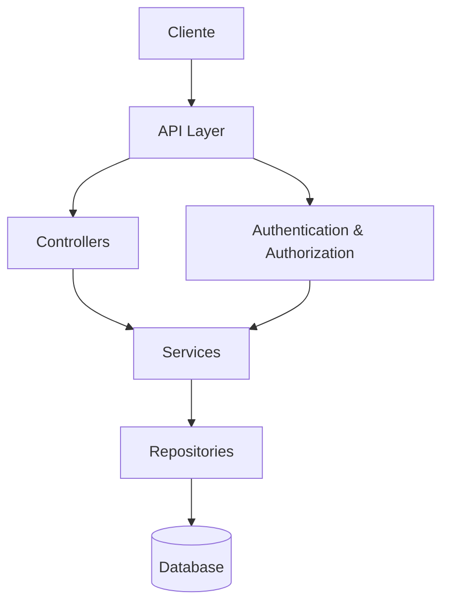
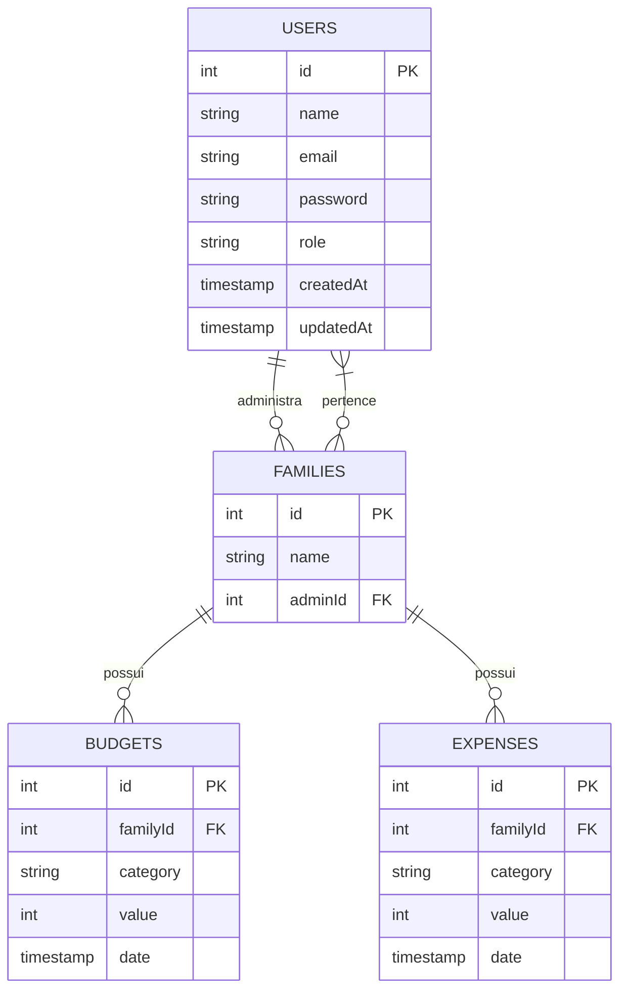

# Análise Arquitetural do Sistema FinFam

## Sumário Executivo

Este documento apresenta uma análise detalhada da arquitetura do backend do sistema FinFam, identificando problemas arquiteturais, dependências problemáticas e sugerindo melhorias na organização do código. A análise foca especialmente na separação de responsabilidades, escalabilidade e manutenibilidade do sistema.

## Visão Geral do Sistema

O FinFam é uma plataforma SaaS de gestão financeira familiar em português que suporta múltiplas famílias (arquitetura multi-tenant) com controle de acesso baseado em funções. A plataforma inclui:

- Página de marketing
- Dashboard empresarial para métricas SaaS
- Dashboards familiares para orçamentos e controle de despesas
- Sistema de autenticação personalizado

## Problemas Identificados

### 1. Inconsistências e Problemas Estruturais

#### 1.1. Inconsistência entre Modelos e Esquema do Banco de Dados

- O arquivo `Family.ts` está vazio, apesar do sistema ser descrito como multi-tenant baseado em famílias.
- Existem discrepâncias significativas entre os modelos em `server/models/` e o esquema em `drizzle/schema.ts`:
  - `Budget.ts` e `Expense.ts` referenciam `userId`, mas o esquema do banco de dados usa `familyId`.
  - Os campos nos modelos não correspondem aos campos no esquema (ex: `name` vs `category`, `amount` vs `value`).
- Não há uma implementação clara do modelo de família no código, apesar de ser um conceito central na arquitetura.

#### 1.2. Falta de Arquitetura em Camadas

- Não existe uma separação clara entre as camadas de:
  - Controladores (rotas)
  - Serviços (lógica de negócios)
  - Repositórios (acesso a dados)
- A lógica de negócios está diretamente nas rotas, o que dificulta a reutilização de código e a testabilidade.
- Não há abstração do acesso ao banco de dados, com consultas SQL diretamente nas rotas.

#### 1.3. Arquitetura Multi-tenant Incompleta

- Embora o sistema seja descrito como multi-tenant, não há uma implementação clara de isolamento de dados entre famílias.
- As rotas não verificam consistentemente se o usuário pertence à família cujos dados estão sendo acessados.
- Não existe um mecanismo para associar usuários a famílias além do administrador.

### 2. Problemas de Autenticação e Autorização

#### 2.1. Duplicação e Inconsistência no Código de Autenticação

- A estratégia LocalStrategy está definida tanto em `authRoutes.ts` quanto em `passportConfig.ts`.
- Em `passportConfig.ts`, linha 19, há uma referência a `user.senha`, mas no modelo User o campo é chamado `password`.
- Não há uma clara separação entre autenticação e autorização.

#### 2.2. Problemas de Segurança

- Em `server.ts`, o segredo da sessão é hardcoded como 'secret'.
- Em `authRoutes.ts`, linha 104, há um comentário sobre geração de token, mas é implementado como 'fake_token'.
- Não há validação adequada de entrada de dados nas rotas.
- Não há proteção contra ataques comuns como CSRF, XSS, etc.

#### 2.3. Implementação Inconsistente de Controle de Acesso

- Diferentes abordagens para implementar o middleware de verificação de função em `budgetRoutes.ts` e `expenseRoutes.ts`.
- Em `expenseRoutes.ts`, a função `withRole` é chamada de forma complexa e aninhada.
- Não há uma estratégia consistente para verificar permissões específicas de recursos.

### 3. Problemas de Implementação e Código

#### 3.1. Falta de Padronização

- Diferentes estilos de código e abordagens em diferentes partes do sistema.
- Inconsistência na nomenclatura (por exemplo, `role` vs `funcao`).
- Não há um padrão claro para tratamento de erros.

#### 3.2. Tratamento de Erros Inadequado

- Muitos blocos try/catch apenas registram o erro e enviam uma mensagem genérica.
- Não há distinção entre diferentes tipos de erros (validação, banco de dados, autenticação).
- Não há um middleware centralizado para tratamento de erros.

#### 3.3. Código Não Testável

- Falta de injeção de dependências.
- Acoplamento forte entre componentes.
- Lógica de negócios misturada com código de infraestrutura.

### 4. Problemas de Escalabilidade e Desempenho

#### 4.1. Falta de Paginação e Filtragem

- Não há paginação nas rotas que retornam listas de itens.
- Não há filtragem ou ordenação de resultados.
- Potencial para problemas de desempenho com grandes conjuntos de dados.

#### 4.2. Falta de Otimização de Consultas

- Não há evidência de otimização de consultas ao banco de dados.
- Não há implementação de cache.
- Não há estratégia para lidar com consultas complexas ou agregações.

## Recomendações de Melhorias

### 1. Reestruturação da Arquitetura

#### 1.1. Implementar uma arquitetura em camadas clara

```
FinFam/
├── server/
│   ├── controllers/       # Manipulação de requisições HTTP
│   ├── services/          # Lógica de negócios
│   ├── repositories/      # Acesso a dados
│   ├── models/            # Definições de tipos/interfaces
│   ├── middleware/        # Middleware de aplicação
│   ├── config/            # Configurações
│   ├── utils/             # Utilitários
│   └── server.ts          # Ponto de entrada
```

#### 1.2. Alinhar modelos com o esquema do banco de dados

- Garantir que todos os modelos em `server/models/` correspondam exatamente ao esquema em `drizzle/schema.ts`.
- Implementar o modelo `Family.ts` adequadamente.
- Padronizar a nomenclatura de campos em todo o sistema.

#### 1.3. Implementar corretamente a arquitetura multi-tenant

- Criar um middleware para verificar se o usuário tem acesso à família específica.
- Implementar um sistema de convites para associar usuários a famílias.
- Garantir que todas as consultas incluam filtros por família.
- Implementar uma tabela de associação entre usuários e famílias para suportar usuários pertencentes a múltiplas famílias.

### 2. Melhorias na Autenticação e Autorização

#### 2.1. Centralizar a lógica de autenticação

- Remover a duplicação da estratégia LocalStrategy.
- Criar um serviço de autenticação separado.
- Implementar autenticação baseada em tokens JWT adequadamente.

#### 2.2. Melhorar a segurança

- Mover segredos para variáveis de ambiente.
- Implementar proteções contra ataques comuns.
- Adicionar validação de entrada em todas as rotas.
- Implementar HTTPS e configurar cabeçalhos de segurança apropriados.

#### 2.3. Padronizar o controle de acesso

- Criar um sistema de permissões baseado em recursos e ações.
- Implementar um middleware consistente para verificação de permissões.
- Documentar claramente as regras de acesso.

### 3. Melhorias na Implementação e Código

#### 3.1. Padronizar o código

- Adotar um guia de estilo consistente.
- Usar ferramentas como ESLint e Prettier.
- Padronizar a nomenclatura em todo o sistema.

#### 3.2. Melhorar o tratamento de erros

- Criar classes de erro personalizadas para diferentes tipos de erros.
- Implementar um middleware centralizado para tratamento de erros.
- Fornecer mensagens de erro mais específicas e úteis.

#### 3.3. Tornar o código mais testável

- Implementar injeção de dependências.
- Separar claramente a lógica de negócios da infraestrutura.
- Adicionar testes unitários e de integração.

### 4. Melhorias de Escalabilidade e Desempenho

#### 4.1. Implementar paginação e filtragem

- Adicionar suporte para paginação em todas as rotas que retornam listas.
- Implementar filtragem e ordenação.
- Documentar claramente os parâmetros de consulta.

#### 4.2. Otimizar consultas ao banco de dados

- Revisar e otimizar consultas.
- Implementar índices apropriados.
- Considerar a implementação de cache para consultas frequentes.

## Diagramas

### Arquitetura Proposta



### Relacionamento de Entidades



## Plano de Implementação

### Fase 1: Correções Estruturais

1. Alinhar modelos com o esquema do banco de dados
2. Implementar o modelo `Family.ts`
3. Corrigir inconsistências de nomenclatura

### Fase 2: Melhorias de Segurança

1. Centralizar a lógica de autenticação
2. Mover segredos para variáveis de ambiente
3. Implementar validação de entrada

### Fase 3: Reestruturação da Arquitetura

1. Criar camadas de controladores, serviços e repositórios
2. Refatorar rotas para usar a nova estrutura
3. Implementar middleware de controle de acesso consistente

### Fase 4: Melhorias de Escalabilidade

1. Implementar paginação e filtragem
2. Otimizar consultas ao banco de dados
3. Adicionar cache para consultas frequentes

## Conclusão

O sistema FinFam apresenta diversos problemas arquiteturais que afetam sua manutenibilidade, escalabilidade e segurança. As principais áreas de preocupação são a inconsistência entre modelos e esquema do banco de dados, a falta de uma arquitetura em camadas clara, problemas na implementação da autenticação e autorização, e questões de escalabilidade.

Implementar as recomendações sugeridas ajudará a criar uma base sólida para o sistema, facilitando sua manutenção e evolução futura. A adoção de uma arquitetura em camadas bem definida, com separação clara de responsabilidades, será particularmente benéfica para a saúde do sistema a longo prazo.